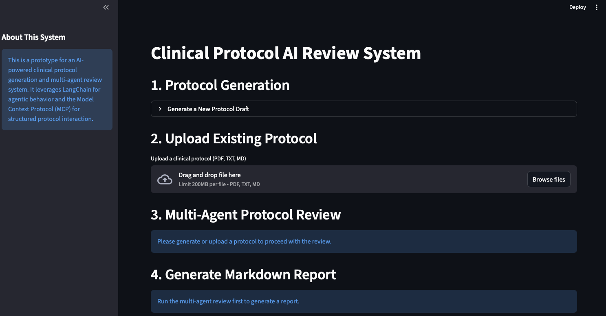

# Clinical Protocol Reviewer
[](https://huggingface.co/spaces/snovaisg/clinical-protocol-reviewer)

Clinical trial protocols go through multiple rounds of review by different experts — principal investigators, site physicians, regulatory specialists — before they're ready for submission. This process is slow, expensive, and often catches critical issues too late.

This tool automates that early review process. Upload a protocol draft (or generate one from scratch), and a panel of AI reviewers will analyze it from multiple expert perspectives, flag potential amendment risks, and give you a scored assessment with actionable recommendations — in minutes instead of weeks.



## How It Works

The system comprises the following key modules:

1.  **Protocol Draft Assistant (`agents/protocol_generator.py`):**
    * Generates initial clinical protocol drafts based on user-defined parameters and predefined templates (e.g., ICH, FDA guidelines).
    * Acts as the initial "Draft Assist" component.

2.  **Multi-Agent Review System (`agents/*.py`):**
    * **Specialized AI Agents:** Multiple agents, each representing a subject matter expert (SME) with a unique perspective, evaluate the protocol:
        * **Principal Investigator (PI) Agent (`agents/pi_agent.py`):** Reviews for scientific rigor, study feasibility, and patient safety from a research leadership perspective.
        * **Site Physician Agent (`agents/site_physician_agent.py`):** Focuses on practical implementation at a clinical site, patient management, and operational challenges.
        * **Health Authority Agent (`agents/health_authority_agent.py`):** Assesses adherence to regulatory guidelines (ICH-GCP, FDA), ethical considerations, and data integrity.

3.  **Amendment Risk Detection & Recommendation (`utils/risk_assessor.py`):**
    * Analyzes consolidated feedback from all specialized agents.
    * Identifies potential issues that could lead to protocol amendments.
    * Provides a severity assessment (Low, Medium, High), rationale, and specific recommendations for improvement.

4.  **Scoring Engine (`utils/scoring_engine.py`):**
    * Assigns a numerical score to the protocol based on the identified risks and their severity. A higher score indicates fewer or less severe issues.


## Setup and Installation

Follow these steps to set up and run the project locally.

### Prerequisites

* An OpenAI API Key

### 1. Clone the Repository

```bash
git clone https://github.com/snovaisg/clinical-protocol-review.git
cd clinical-protocol-review
```

### 2. Install Dependencies

The setup script installs [uv](https://docs.astral.sh/uv/) (if needed), resolves the correct Python version, and installs all dependencies:

**macOS / Linux:**
```bash
./setup_mac_linux.sh
```

**Windows (PowerShell):**
```powershell
.\setup_windows.ps1
```

### 3. Configure Environment Variables

Create a `.env` file in the root directory of your project and add your OpenAI API key:

```
OPENAI_API_KEY="OPENAI_API_KEY_HERE"
```

### 4. Add Protocol Templates (optional)

The `templates/` directory is structured for different guideline types. Populate `templates/ich_templates/ich_template_v1.md` with a basic ICH-compliant markdown protocol structure.

### 5. Run the Application

```bash
uv run streamlit run streamlit_app.py
```


#### Usage
1. Generate Protocol Draft: Use the "Protocol Generation" section to input basic study parameters and generate a new protocol draft using an LLM.
2. Upload Existing Protocol: Upload a protocol file (PDF, TXT, or MD) to be reviewed. The system will extract its text content.
3. Start Multi-Agent Review: Once a protocol is displayed, click "Start Multi-Agent Review". The specialized AI agents will then process the protocol, provide their feedback, and the system will present an amendment risk assessment, recommendations, and an overall score.
4. Download Review: Get the review back in markdown and pdf.

## Deploying to Hugging Face Spaces

The repo includes `app_hf.py` and `requirements.txt` for deploying to [Hugging Face Spaces](https://huggingface.co/spaces). This variant lets users provide their own OpenAI API key via the sidebar (no `.env` file needed) and downloads reports as a ZIP.

To deploy:

1. Create a new Space on Hugging Face (SDK: **Streamlit**).
2. In the Space repo, add a `README.md` with the required HF metadata header:
   ```yaml
   ---
   title: Clinical Protocol AI Review
   emoji: 🧬
   colorFrom: blue
   colorTo: green
   sdk: streamlit
   sdk_version: "1.30.0"
   app_file: app_hf.py
   pinned: false
   ---
   ```
3. Push the project files (including `app_hf.py`, `requirements.txt`, `agents/`, `utils/`, `mcp_interface/`, `templates/`, and `example-protocols/`) to the Space repo.
4. The Space will install dependencies from `requirements.txt` and launch `app_hf.py` automatically.

